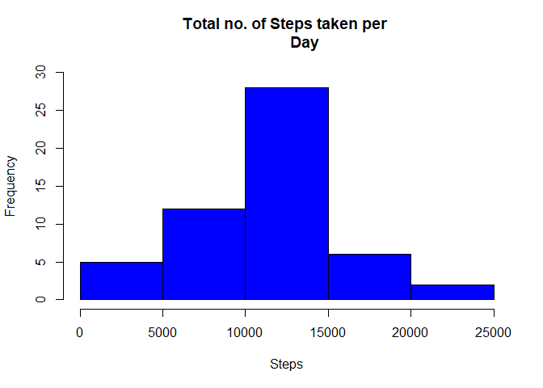
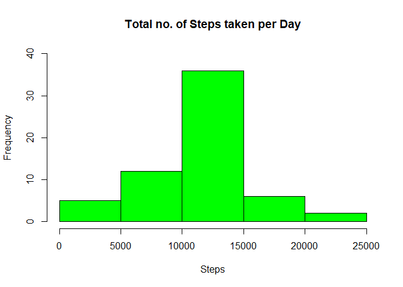

## Loading and preprocessing the data
1. Load the data (i.e. read.csv()) 
2. Process/transform the data (if necessary) into a format suitable for your analysis.  
    Note: For Reading in the data, I am assuming that the file is in the activity sub-folder as in the GitHub.
    The filename is activity.csv.

```r
    ActivityData <- read.csv("activity/activity.csv",colClasses=c("numeric","Date","integer"))
```


## What is mean total number of steps taken per day?
For this part of the assignment, you can ignore the missing values in the dataset.  
1. Make a histogram of the total number of steps taken each day.  
    In order to get the total no.of steps per date, I am using the aggregate function.

```r
    SumActivity <- aggregate(ActivityData$steps ~ ActivityData$date, FUN=sum)
    colnames(SumActivity) <- c("Date","Steps")
```

    Plotting a Histogram of the Total No of Steps taken per day.
    Note: Here I am setting the Y freq to 30 since there were some points greater than the default. 

```r
    hist(SumActivity$Steps, col="Blue",xlab="Steps",ylab="Frequency",main = "Total no. of Steps taken per 
         Day",ylim=c(0,30))    
```

<!-- -->

2. Calculate and report the mean and median total number of steps taken per day


```r
MeanValue <- mean(SumActivity$Steps)
MedianValue <- median(SumActivity$Steps)
```

#### Reporting the mean and the median values:  
The mean of the no. of steps taken per day is: 10766.19.  
The Median of the no. of steps taken per day is: 10765.


## What is the average daily activity pattern?

```r
library(plyr)

## Remove the NA's
NewActivityData <- ActivityData[!is.na(ActivityData$steps),]

## Identify average number of steps per interval
AvgStepsInterval <- ddply(NewActivityData, .(interval), summarize, AvgSteps = mean(steps))
```

1. Make a time series plot (i.e. type = "l") of the 5-minute interval (x-axis) and the average number
   of steps taken, averaged across all days (y-axis) 

```r
plot(AvgStepsInterval$interval,AvgStepsInterval$AvgSteps,type="l",main="Average no of steps per Interval", 
       xlab="Interval", ylab="Average no of steps")
```

<!-- -->
  
2. Which 5-minute interval, on average across all the days in the dataset, contains the maximum number of steps?

```r
MaxStepsInterval <- AvgStepsInterval[which.max(AvgStepsInterval$AvgSteps),] 
```

The interval which contains the maximum number of steps is: 835


## Imputing missing values
1. Calculate and report the total number of missing values in the dataset (i.e. the total number of rows with NAs) 

```r
TotalNaVals <- sum(is.na(ActivityData$steps))
```
The Total No of Missing Values in the dataset is: 2304

2. Devise a strategy for ???lling in all of the missing values in the dataset. The strategy does not need 
    to be sophisticated. For example, you could use the mean/median for that day, or the mean for that 
    5-minute interval, etc.  
    Note: Strategy chosen is the mean for the 5 minute interval

```r
FilledData <- ActivityData
DataOfNas <- is.na(FilledData$steps)
AvgIntervalData <- tapply(FilledData$steps, FilledData$interval, mean, na.rm=TRUE)
```

3. Create a new dataset that is equal to the original dataset but with the missing data filled in.

```r
FilledData$steps[DataOfNas] <- AvgIntervalData[as.character(FilledData$interval[DataOfNas])]
```
To prove equivalency

```r
str(ActivityData)
```

```
## 'data.frame':	17568 obs. of  3 variables:
##  $ steps   : num  NA NA NA NA NA NA NA NA NA NA ...
##  $ date    : Date, format: "2012-10-01" "2012-10-01" ...
##  $ interval: int  0 5 10 15 20 25 30 35 40 45 ...
```

```r
str(FilledData)
```

```
## 'data.frame':	17568 obs. of  3 variables:
##  $ steps   : num  1.717 0.3396 0.1321 0.1509 0.0755 ...
##  $ date    : Date, format: "2012-10-01" "2012-10-01" ...
##  $ interval: int  0 5 10 15 20 25 30 35 40 45 ...
```

Make a histogram of the total number of steps taken each day and Calculate 
and report the mean and median total number of steps taken per day. 
Do these values di???er from the estimates from the ???rst part of the assignment? 
What is the impact of imputing missing data on the estimates of the total daily number of steps?


```r
## Plotting a Histogram of the Total No of Steps taken per day.
## Here I am setting the Y freg to 40 since there were some points greater than the default. 
FilledActivity <- aggregate(FilledData$steps ~ FilledData$date, FUN=sum)
## Explictly changing the names of the columns in the Data Frame so that it is easier to query.
colnames(FilledActivity) <- c("Date","Steps")
hist(FilledActivity$Steps, col="Green",xlab="Steps",ylab="Frequency",main = "Total no. of Steps taken per Day",ylim=c(0,40))      
```

<!-- -->

```r
## Calculating the mean and the median in the dataset
MeanFilledValue <- mean(FilledActivity$Steps)
MedianFilledValue <- median(FilledActivity$Steps)
```

#### Observations:  
The new mean is 10766.19 which is the same as the previously calulated mean value of 10766.19.  
The new median value is 10766.19 while the old was 10765.  
Hence the impact of filling in the missing values is that there is a increase in the total no of steps in the active intervals while the overall mean value in the number of steps remains the same.


## Are there differences in activity patterns between weekdays and weekends?
1. Create a new factor variable in the dataset with two levels - "weekday" and "weekend" 
indicating whether a given date is a weekday or weekend day. 

```r
FilledData <- mutate(FilledData, WType = ifelse(weekdays(FilledData$date) == "Saturday" | weekdays(FilledData$date) == "Sunday", "WeekEnd", "WeekDay"))
```

2. Make a panel plot containing a time series plot (i.e. type = "l") of the 5-minute interval (x-axis) 
   and the average number of steps taken, averaged across all weekday days or weekend days (y-axis).

```r
FinalData <- ddply(FilledData, .(interval, WType), summarize, AvgSteps = mean(steps))

##Plot data in a panel plot
library(lattice) 
xyplot(AvgSteps~interval|WType, data=FinalData, type="l",  layout = c(1,2),
       main="Number of Steps for Type of Day", xlab="Interval", ylab="Number of Steps")
```

<!-- -->
